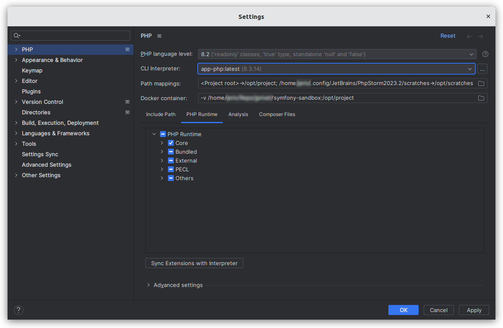
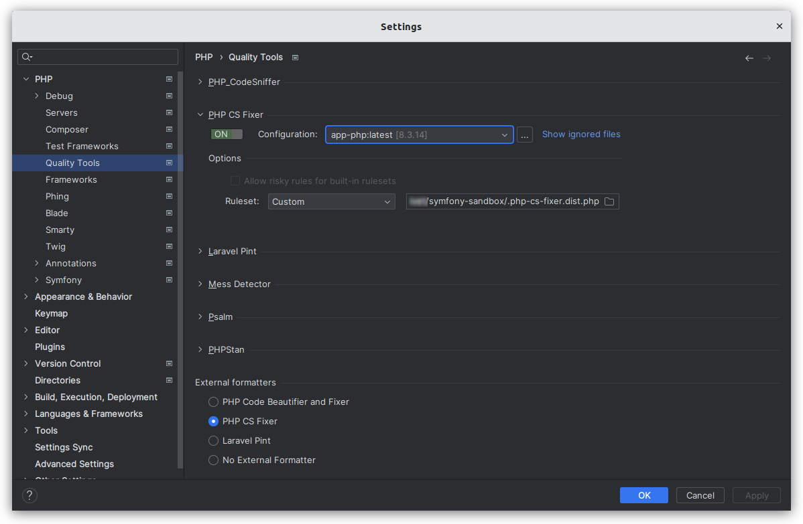
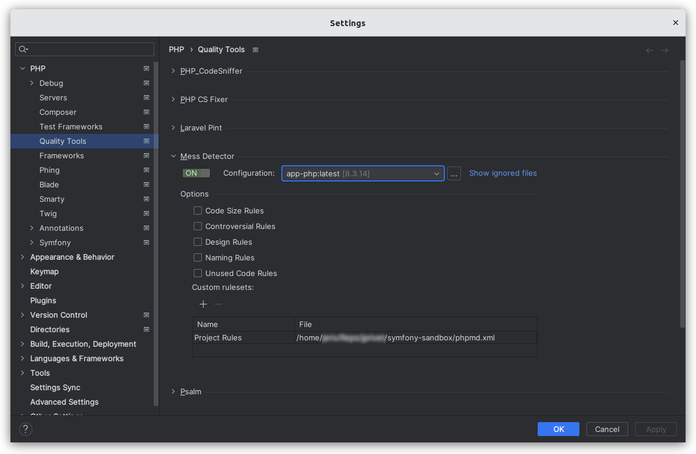
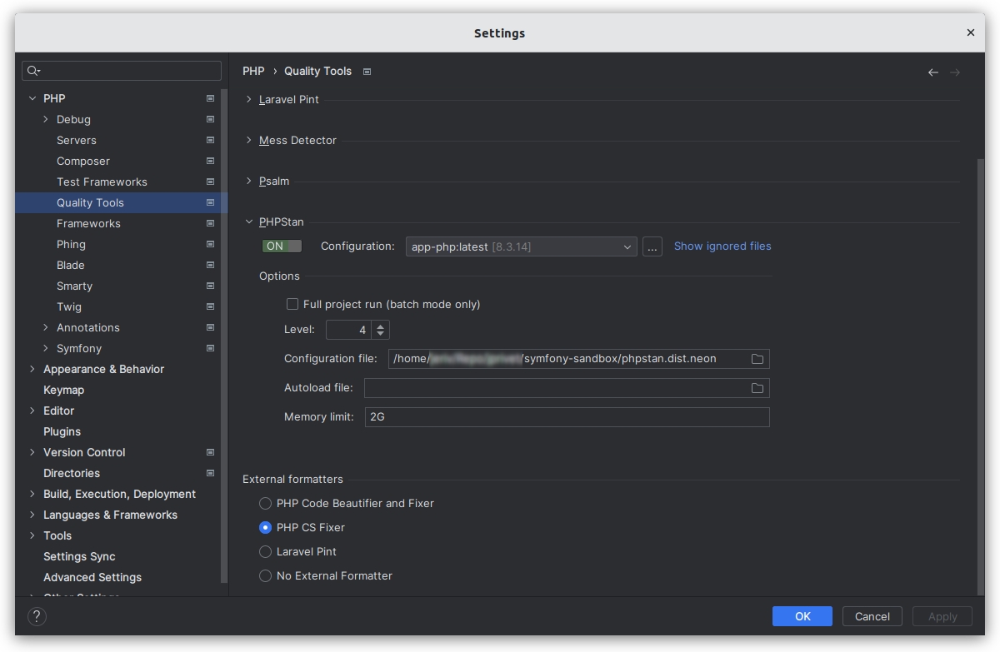
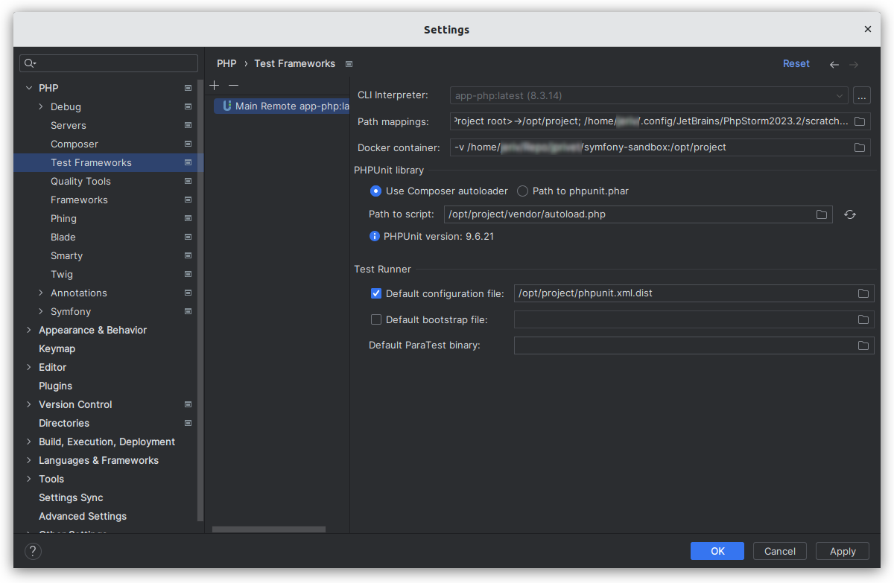

# Configure PhpStorm & VS Code

⬅️ [Go back to README](../README.md)

> This configuration is provided for PhpStorm 2023.2.1

## Remote PHP interpreter (Docker)

### About

You can access a PHP interpreter installed in a Docker container. This is the main configuration to be made before any others.

### PhpStorm

- Go on **Settings (Ctrl+Alt+S) > Build, Execution, Deployment > Docker**.
    - Click on `+`:
        - Name: `Docker`.
        - Unix socket: `default unix:///.../docker.sock`.
    - Click on `OK`.


- Go on **Settings (Ctrl+Alt+S) > PHP**.
    - In the **PHP** section, click on `…`, next to the **CLI Interpreter** list.
    - In the **CLI Interpreters** dialog, click on `+`.
    - In the **Select CLI Interpreters** dialog, select **From Docker, Vagrant, VM, WSL, Remote…**.
    - In the **Configure Remote PHP Interpreter** dialog:
        - Server: `Docker`.
        - Image name: `app-php:latest`.
        - PHP interpreter path: `php`.
        - Click on `OK`.
    - In the **CLI Interpreters** dialog:
        - In the **Docker** area:
            - Server: `Docker`.
            - Image name: `app-php:latest`.
        - In the **General** area:
            - PHP executable: `php`.
            - Configuration file: empty.
            - PHP version is dynamically indicated.
            - Configuration file is dynamically indicated.
        - Click on `OK`.
- In the **Settings** dialog, click on `OK` or `Apply` to validate all.



### VS Code

TODO

### Resources

- https://www.jetbrains.com/help/phpstorm/configuring-remote-interpreters.html

## PHP CS Fixer

### About

The PHP Coding Standards Fixer (PHP CS Fixer) tool fixes your code to follow standards; whether you want to follow PHP coding standards as defined in the PSR-1, PSR-2, etc., or other community driven ones like the Symfony one.

### Installation

```
composer require --dev friendsofphp/php-cs-fixer
```

### PhpStorm

- Go on **Settings (Ctrl+Alt+S) > PHP > Quality Tools**.
- Expand the **PHP CS Fixer** area and switch `ON` the tool.
- In **Configuration**, choose **app-php:latest**.
- In **Options > Ruleset**, choose the `.php-cs-fixer.dist.php` file of this repository.
- In **External formatters**, choose `PHP CS Fixer`.
- In the **Settings** dialog, click on `OK` or `Apply` to validate all.



### VS Code

TODO

### Resources

- https://cs.symfony.com/
- https://github.com/PHP-CS-Fixer/PHP-CS-Fixer

## PHP_CodeSniffer

### About

PHP_CodeSniffer is a set of two PHP scripts:

- `phpcs` (PHP_CodeSniffer) script that tokenizes PHP, JavaScript and CSS files to detect violations of a defined coding standard.
- `phpcbf` (PHP Code Beautifier and Fixer) script automatically correct coding standard violations.

> ❌ **PHP_CodeSniffer** is not used in this project. **PHP CS Fixer** is used instead.

### Resources

- https://github.com/PHPCSStandards/PHP_CodeSniffer/

## PHP Mess Detector

### About

PHPMD takes a given PHP source code base and look for several potential problems within that source. These problems can be things like:

- Possible bugs
- Suboptimal code
- Overcomplicated expressions
- Unused parameters, methods, properties

### Installation

```
composer require --dev phpmd/phpmd
```

### PhpStorm

- Go on **Settings (Ctrl+Alt+S) > PHP > Test Framework**.
- Click on `+` and select **PHPUnit by Remote Interpreter**.
- In the **PHPUnit by Remote Interpreter** dialog, select `Interpreter: php`.
- Click on `OK`.
- In the **Settings** dialog:
    - ClI interpreter: `app-php:latest`.
    - In **PHPUnit library** area:
        - Choose **Use Composer autoloader**.
        - Path to script: `/app/vendor/autoload.php`.
        - PHPUnit version is indicated.
    - In **Test Runner** area:
        - Default configuration file: `/app/phpunit.xml.dist`.
    - Click on `OK` or `Apply` to validate all.



### VS Code

TODO

### Resources

- https://phpmd.org/
- https://github.com/phpmd/phpmd
- https://packagist.org/packages/phpmd/phpmd
- https://www.jetbrains.com/help/phpstorm/using-php-mess-detector.html

## PHPStan

### About

PHPStan scans your whole codebase and looks for both obvious & tricky bugs.

### Installation

```
composer require --dev phpstan/phpstan
Do you want to execute this recipe?
...
(defaults to n): y
```

### PhpStorm

- Go on **Settings (Ctrl+Alt+S) > PHP > Quality Tools**.
- Expand the **PHPStan** area and switch `ON` the tool.
- In **Configuration**, choose **app-php:latest**.
- In **Options** area:
    - Level: `6`.
    - Configuration file: choose the `phpstan.dist.neon` file of this repository.
- In the **Settings** dialog, click on `OK` or `Apply` to validate all.



### VS Code

TODO

### Resources

- https://phpstan.org/
- https://packagist.org/packages/phpstan/phpstan-doctrine

## PHPUnit

### About

PHPUnit is a programmer-oriented testing framework for PHP. It is an instance of the xUnit architecture for unit testing frameworks.

### Installation

```
composer require --dev symfony/test-pack
```

### PhpStorm

- Go on **Settings (Ctrl+Alt+S) > PHP > Test Framework**.
- Click on `+` and select **PHPUnit by Remote Interpreter**.
- In the **PHPUnit by Remote Interpreter** dialog:
    - Select `Interpreter: app-php:latest`.
    - Click on `OK`.
- In the **Settings** dialog:
    - ClI interpreter: `app-php:latest`.
    - In the **PHPUnit library** area:
        - Choose **Use Composer autoloader**.
        - Path to script: `/opt/project/vendor/autoload.php`.
        - PHPUnit version is indicated after the click on refresh button.
    - In the **Test Runner** area:
        - Default configuration file: `/opt/project/phpunit.xml.dist`.
    - Click on `OK` or `Apply` to validate all.



#### Run tests

### VS Code

TODO

### Resources

- https://phpunit.de/
- https://symfony.com/doc/current/testing.html
- https://www.jetbrains.com/help/phpstorm/using-phpunit-framework.html
- https://github.com/dunglas/symfony-docker/blob/main/docs/xdebug.md
- https://www.youtube.com/watch?v=I7aGWO6K3Ho
