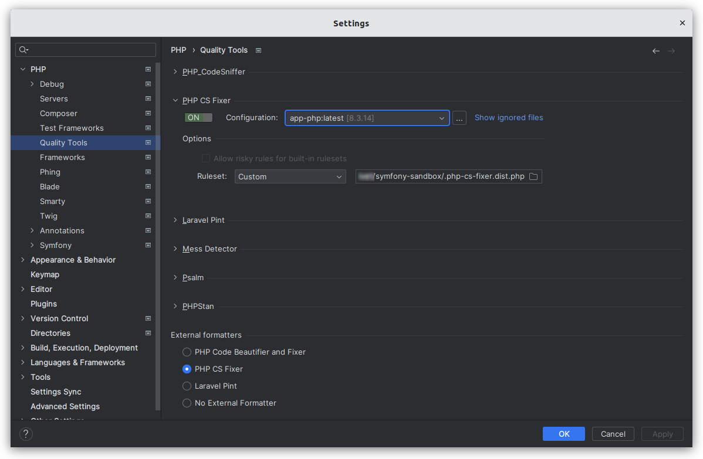

# PHP CS Fixer

⬅️ [Configure PhpStorm & VS Code](../configure.md)

## About

The PHP Coding Standards Fixer (PHP CS Fixer) tool fixes your code to follow standards; whether you want to follow PHP coding standards as defined in the PSR-1, PSR-2, etc., or other community driven ones like the Symfony one.

## Installation

```
composer require --dev friendsofphp/php-cs-fixer
```

## PhpStorm

- Go on **Settings (Ctrl+Alt+S) > PHP > Quality Tools**.
- Expand the **PHP CS Fixer** area and switch `ON` the tool.
- In **Configuration**, choose **app-php:latest**.
- In **Options > Ruleset**, choose the `.php-cs-fixer.dist.php` file of this repository.
- In **External formatters**, choose `PHP CS Fixer`.
- In the **Settings** dialog, click on `OK` or `Apply` to validate all.



## VS Code

TODO

## Resources

- https://cs.symfony.com/
- https://github.com/PHP-CS-Fixer/PHP-CS-Fixer