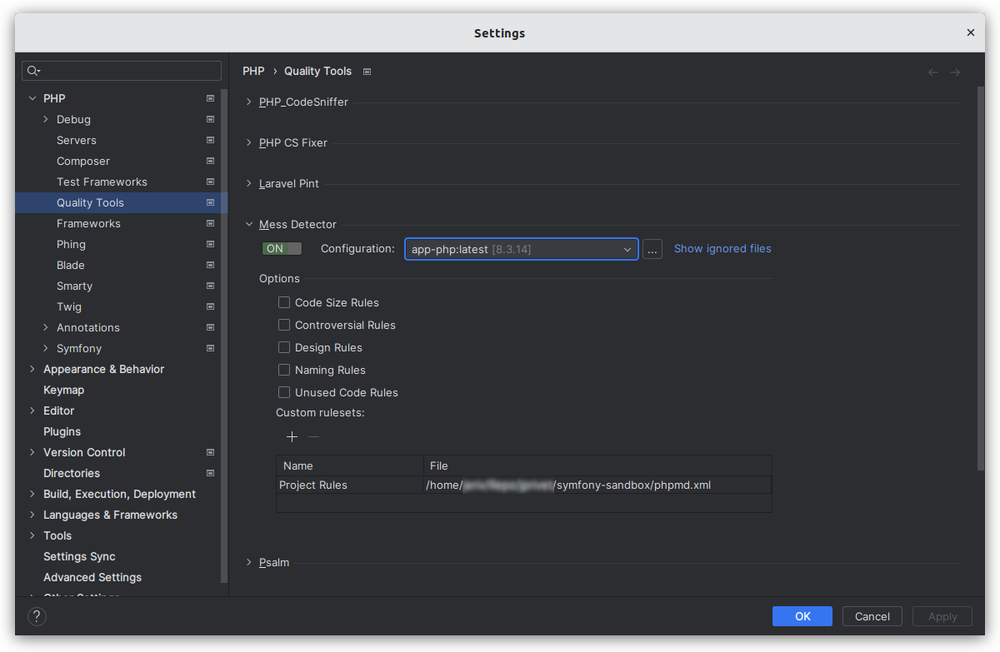

# PHP Mess Detector

⬅️ [Configure PhpStorm & VS Code](../configure.md)

## About

PHPMD takes a given PHP source code base and look for several potential problems within that source. These problems can be things like:

- Possible bugs
- Suboptimal code
- Overcomplicated expressions
- Unused parameters, methods, properties

## Installation

```
composer require --dev phpmd/phpmd
```

## PhpStorm

- Go on **Settings (Ctrl+Alt+S) > PHP > Test Framework**.
- Click on `+` and select **PHPUnit by Remote Interpreter**.
- In the **PHPUnit by Remote Interpreter** dialog, select `Interpreter: php`.
- Click on `OK`.
- In the **Settings** dialog:
    - CLI interpreter: `app-php:latest`.
    - In **PHPUnit library** area:
        - Choose **Use Composer autoloader**.
        - Path to script: `/app/vendor/autoload.php`.
        - PHPUnit version is indicated.
    - In **Test Runner** area:
        - Default configuration file: `/app/phpunit.xml.dist`.
    - Click on `OK` or `Apply` to validate all.



## VS Code

TODO

## Resources

- https://phpmd.org/
- https://github.com/phpmd/phpmd
- https://packagist.org/packages/phpmd/phpmd
- https://www.jetbrains.com/help/phpstorm/using-php-mess-detector.html