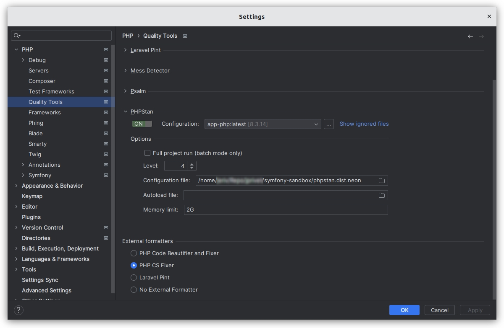

# PHPStan

⬅️ [Configure PhpStorm & VS Code](../configure.md)

## About

PHPStan scans your whole codebase and looks for both obvious & tricky bugs.

## Installation

PHPStan - PHP Static Analysis Tool:

```
composer require --dev phpstan/phpstan
```

PHPStan PHPUnit extensions and rules:

```
composer require --dev phpstan/phpstan-phpunit
```

Doctrine extensions for PHPStan:

```
composer require --dev phpstan/phpstan-doctrine
```

## PhpStorm

> Prerequisite : configure a [Remote PHP interpreter (Docker)](configure-remote-php-interpreter.md)

- Go on **Settings (Ctrl+Alt+S) > PHP > Quality Tools**.
- Expand the **PHPStan** area and switch `ON` the tool.
- In **Configuration**, choose `app-php:latest`.
- In **Options** area:
    - Level: `6`.
    - Configuration file: choose the `phpstan.dist.neon` file of this repository.
- In the **Settings** dialog, click on `OK` or `Apply` to validate all.



## VS Code

TODO

## Resources

- https://phpstan.org/
- https://packagist.org/packages/phpstan/phpstan-doctrine
- https://github.com/phpstan/phpstan-phpunit
- https://github.com/phpstan/phpstan-doctrine
