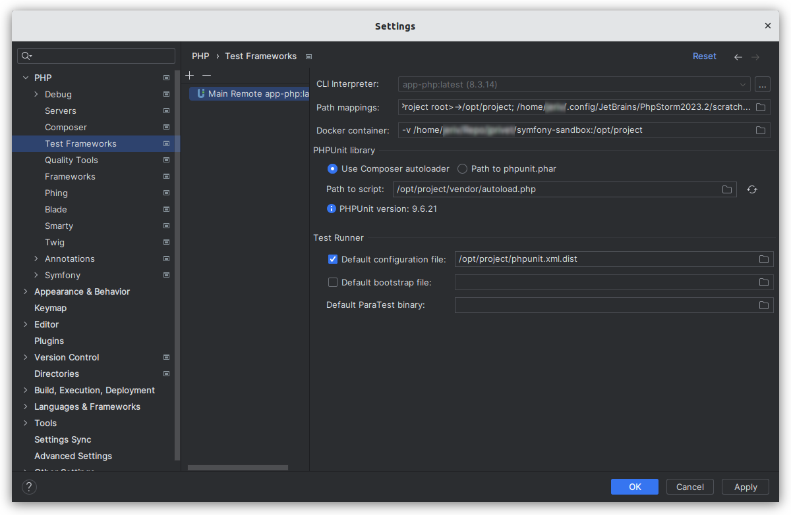
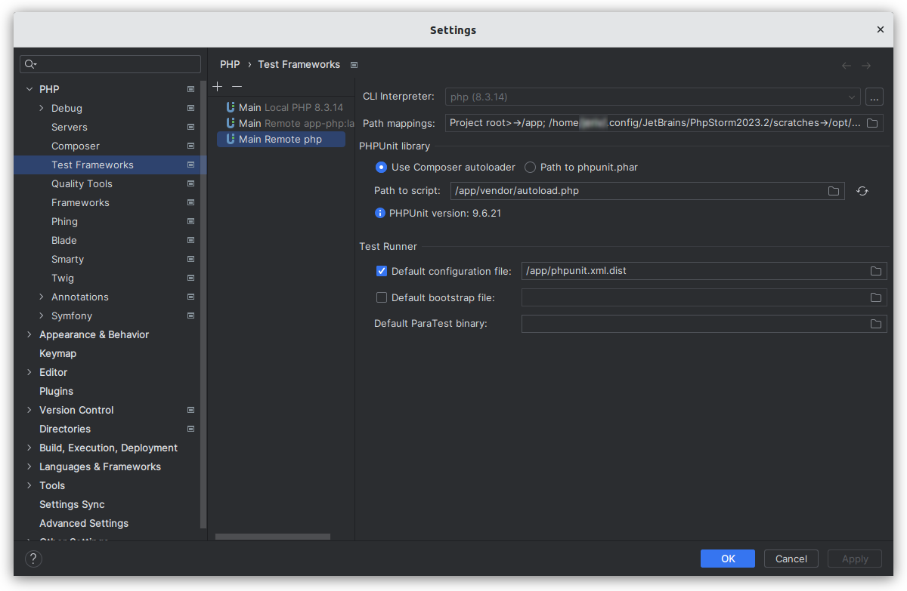

# PHPUnit

⬅️ [Configure PhpStorm & VS Code](../configure.md)

## About

PHPUnit is a programmer-oriented testing framework for PHP. It is an instance of the xUnit architecture for unit testing frameworks.

## Installation

```
composer require --dev symfony/test-pack
```

## PhpStorm

### If you need to use the PHP interpreter without a database

- Go on **Settings (Ctrl+Alt+S) > PHP > Test Framework**.
- Click on `+` and select **PHPUnit by Remote Interpreter**.
- In the **PHPUnit by Remote Interpreter** dialog:
    - Select **Interpreter**: `app-php:latest`.
    - Click on `OK`.
- In the **Settings** dialog:
    - CLI interpreter: `app-php:latest`.
    - In the **PHPUnit library** area:
        - Choose **Use Composer autoloader**.
        - Path to script: `/opt/project/vendor/autoload.php`.
        - PHPUnit version is indicated after the click on refresh button.
    - In the **Test Runner** area:
        - Default configuration file: `/opt/project/phpunit.xml.dist`.
    - Click on `OK` or `Apply` to validate all.



### If you need to use the PHP interpreter with a database

- Go on **Settings (Ctrl+Alt+S) > PHP > Test Framework**.
- Click on `+` and select **PHPUnit by Remote Interpreter**.
- In the **PHPUnit by Remote Interpreter** dialog:
    - Click on `…`, next to the **Interpreter** list.
    - In the **CLI Interpreters** dialog, click on `+`:
        - In the **Select CLI Interpreters** dialog, select **From Docker, Vagrant, VM, WSL, Remote…**.
        - In the **Configure Remote PHP Interpreter** dialog:
            - Select **Docker Compose**.
            - Server: `Docker`.
            - Configuration files: add `./compose.yaml` and `./compose.override.yaml`.
            - Service: `php`.
            - Environment variables: empty.
            - PHP interpreter path: `php`.
            - Click on `OK`.
    - In the **CLI Interpreters** dialog:
        - In the **Docker Compose** area:
            - Select **Docker Compose**.
            - Server: `Docker`.
            - Configuration files: `./compose.yaml` and `./compose.override.yaml`.
            - Service: `php`.
            - Environment variables: empty.
        - In the **Lifecycle** area:
            - Choose `Connect to existing container ('docker-compose exec')`.
        - In the **General** area:
            - PHP executable: `php`.
            - Configuration file: empty.
            - PHP version is automaticaly indicated.
            - Configuration file  is automaticaly indicated
        - Click on `OK`
- In the **PHPUnit by Remote Interpreter** dialog:
    - Select **Interpreter**: `php`.
    - Click on `OK`.
- In the **Settings** dialog:
    - CLI interpreter: `php`.
    - In the **PHPUnit library** area:
        - Choose **Use Composer autoloader**.
        - Path to script: `/app/vendor/autoload.php`.
        - PHPUnit version is automaticaly indicated.
    - In the **Test Runner** area:
        - Default configuration file: `/app/phpunit.xml.dist`.
    - Click on `OK` or `Apply` to validate all.



### Run tests

TODO

## VS Code

TODO

## Resources

- https://phpunit.de/
- https://symfony.com/doc/current/testing.html
- https://www.jetbrains.com/help/phpstorm/using-phpunit-framework.html
- https://github.com/dunglas/symfony-docker/blob/main/docs/xdebug.md
- https://www.youtube.com/watch?v=I7aGWO6K3Ho