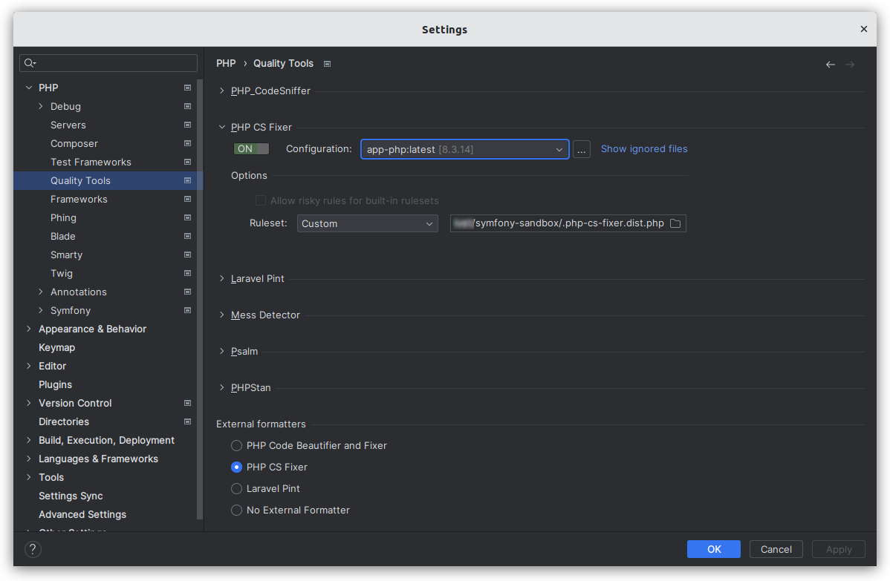

# Quality - PHP CS Fixer

⬅️ [Quality](../quality.md)

## About

The PHP Coding Standards Fixer (PHP CS Fixer) tool fixes your code to follow standards; whether you want to follow PHP coding standards as defined in the PSR-1, PSR-2, etc., or other community driven ones like the Symfony one.

## Installation

```
composer require --dev friendsofphp/php-cs-fixer
```

## Makefile

> Run `make` to see all shorcuts for the most common tasks.

## Configure PhpStorm

> Prerequisite : configure a [Remote PHP interpreter (Docker)](../remote-php-interpreter.md)

- Go on **Settings (Ctrl+Alt+S) > PHP > Quality Tools**.
- Expand the **PHP CS Fixer** area:
    - Switch `ON` the tool.
    - In **Configuration**, choose `app-php:latest`.
    - In **Options > Ruleset**, choose the `.php-cs-fixer.dist.php` file of this repository.
- In **External formatters** area:
    - Choose `PHP CS Fixer`.
- In the **Settings** dialog, click on `OK` or `Apply` to validate all.



## Configure VS Code

TODO

## Resources

- https://cs.symfony.com/
- https://github.com/PHP-CS-Fixer/PHP-CS-Fixer