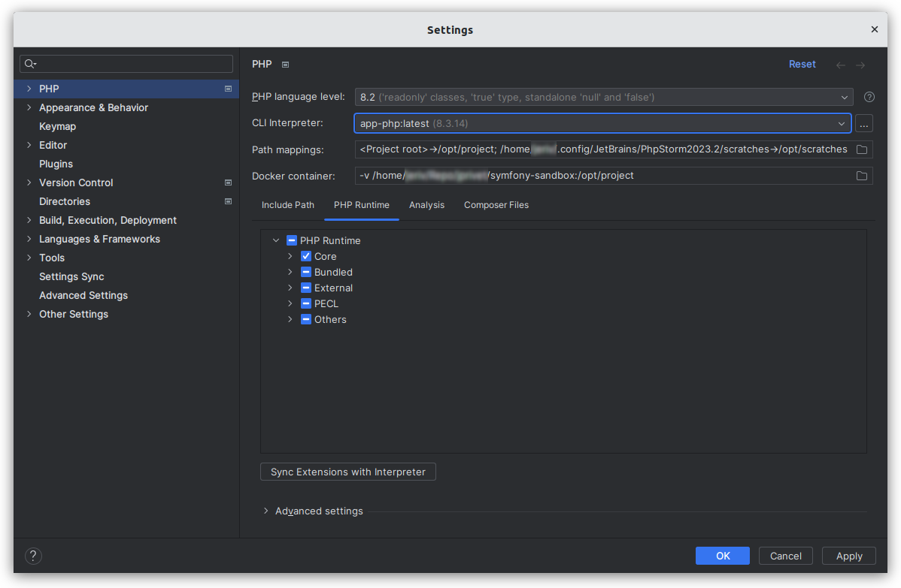

# Remote PHP interpreter (Docker)

⬅️ [README](../README.md)

## About

You can access a PHP interpreter installed in a Docker container. This is the main configuration to be made before any others.

## Configure PhpStorm

### 1. Connect to Docker daemon

- Go on **Settings (Ctrl+Alt+S) > Build, Execution, Deployment > Docker**.
    - Click on `+`:
        - Name: `Docker`.
        - Unix socket: `default unix:///.../docker.sock`.
    - Click on `OK`.

### 2. Select the PHP interpreter image

- Go on **Settings (Ctrl+Alt+S) > PHP**.
    - In the **PHP** section, click on `…`, next to the **CLI Interpreter** list.
    - In the **CLI Interpreters** dialog, click on `+`.
    - In the **Select CLI Interpreters** dialog, select **From Docker, Vagrant, VM, WSL, Remote…**.
    - In the **Configure Remote PHP Interpreter** dialog:
        - Server: `Docker`.
        - Image name: `app-php:latest`.
        - PHP interpreter path: `php`.
        - Click on `OK`.
    - In the **CLI Interpreters** dialog:
        - In the **Docker** area:
            - Server: `Docker`.
            - Image name: `app-php:latest`.
        - In the **General** area:
            - PHP executable: `php`.
            - Configuration file: empty.
            - PHP version is dynamically indicated.
            - Configuration file is dynamically indicated.
        - Click on `OK`.
- In the **Settings** dialog, click on `OK` or `Apply` to validate all.
  Select the image of the PHP interpreter

## Configure VS Code

TODO

## Resources

- https://www.jetbrains.com/help/phpstorm/configuring-remote-interpreters.html
