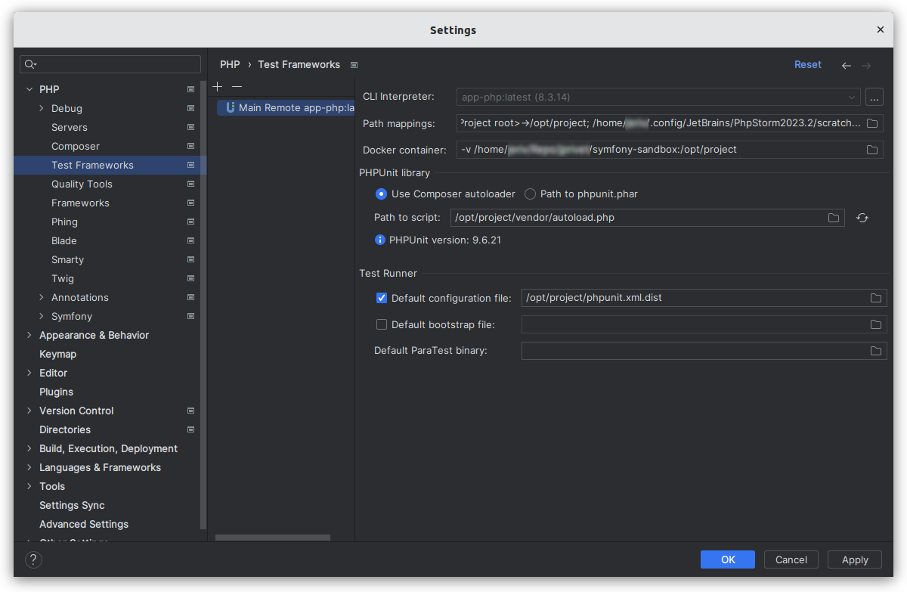
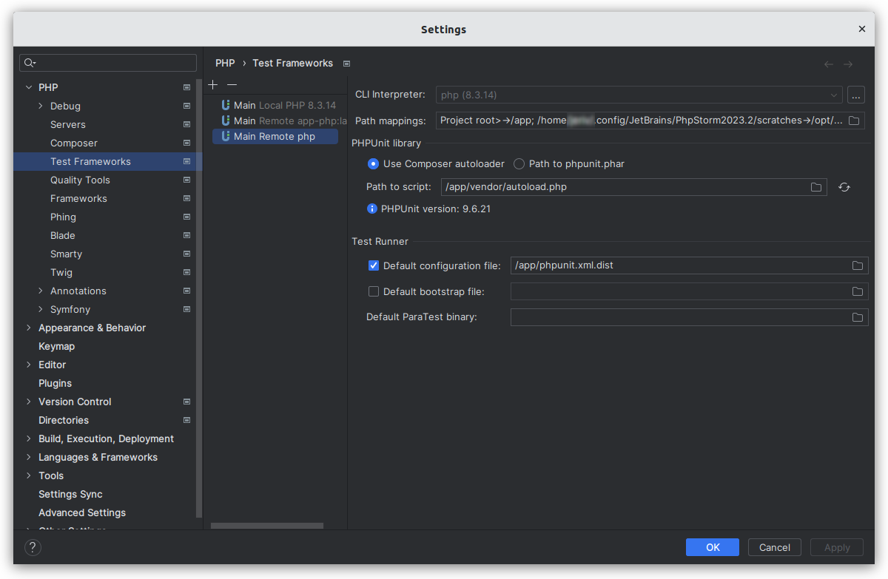

# Testing - Configure PhpStorm

⬅️ [Testing](../testing.md)

## Use PHP interpreter without a database (Docker)

> Prerequisite : configure a [Remote PHP interpreter (Docker)](../remote-php-interpreter.md)

- Go on **Settings (Ctrl+Alt+S) > PHP > Test Framework**.
- Click on `+` and select **PHPUnit by Remote Interpreter**.
- In the **PHPUnit by Remote Interpreter** dialog:
    - Select **Interpreter**: `app-php:latest`.
    - Click on `OK`.
- In the **Settings** dialog:
    - CLI interpreter: `app-php:latest`.
    - In the **PHPUnit library** area:
        - Choose **Use Composer autoloader**.
        - Path to script: `/opt/project/vendor/autoload.php`.
        - PHPUnit version is indicated after the click on refresh button.
    - In the **Test Runner** area:
        - Default configuration file: `/opt/project/phpunit.xml.dist`.
    - Click on `OK` or `Apply` to validate all.

## Use PHP interpreter with a database (Docker Compose)

> In this case, you will configure a **remote PHP interpreter with Docker Compose**, because you will need the relationships between the containers (PHP, database, etc.), with the specifics Symfony development environment variables.

- Go on **Settings (Ctrl+Alt+S) > PHP > Test Framework**.
- Click on `+` and select **PHPUnit by Remote Interpreter**.
- In the **PHPUnit by Remote Interpreter** dialog:
    - Click on `…`, next to the **Interpreter** list.
    - In the **CLI Interpreters** dialog, click on `+`:
        - In the **Select CLI Interpreters** dialog, select **From Docker, Vagrant, VM, WSL, Remote…**.
        - In the **Configure Remote PHP Interpreter** dialog:
            - Select **Docker Compose**.
            - Server: `Docker`.
            - Configuration files: add `./compose.yaml` and `./compose.override.yaml`.
            - Service: `php`.
            - Environment variables: empty.
            - PHP interpreter path: `php`.
            - Click on `OK`.
    - In the **CLI Interpreters** dialog:
        - In the **Docker Compose** area:
            - Select **Docker Compose**.
            - Server: `Docker`.
            - Configuration files: `./compose.yaml` and `./compose.override.yaml`.
            - Service: `php`.
            - Environment variables: empty.
        - In the **Lifecycle** area:
            - Choose `Connect to existing container ('docker-compose exec')`.
        - In the **General** area:
            - PHP executable: `php`.
            - Configuration file: empty.
            - PHP version is automaticaly indicated.
            - Configuration file  is automaticaly indicated
        - Click on `OK`
- In the **PHPUnit by Remote Interpreter** dialog:
    - Select **Interpreter**: `php`.
    - Click on `OK`.
- In the **Settings** dialog:
    - CLI interpreter: `php`.
    - In the **PHPUnit library** area:
        - Choose **Use Composer autoloader**.
        - Path to script: `/app/vendor/autoload.php`.
        - PHPUnit version is automaticaly indicated.
    - In the **Test Runner** area:
        - Default configuration file: `/app/phpunit.xml.dist`.
    - Click on `OK` or `Apply` to validate all.

## Run tests

TODO

## Resources

- https://www.jetbrains.com/help/phpstorm/using-phpunit-framework.html
- [Youtube: Running PHPUnit Tests in PhpStorm with Docker](https://www.youtube.com/watch?v=I7aGWO6K3Ho)